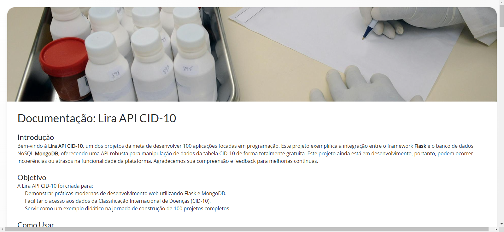

# API CID-10



---

### 📑 Sumário

- [Descrição](#🩺-descrição)
- [Tecnologias](#⚙️-tecnologias)
- [Como Usar](#🚀-como-usar)
- [Referências](#📎-referências)
- [Licença](#📄-licença)
- [Autor](#👨‍💻-autor)

---

## 🩺 Descrição

A **Classificação Internacional de Doenças (CID-10)** é um sistema padronizado desenvolvido pela Organização Mundial da Saúde (OMS) para codificar doenças e problemas relacionados à saúde. Seu objetivo é facilitar o registro, análise e compartilhamento de dados de forma padronizada em todo o mundo.

Essa API foi criada para permitir consultas rápidas e gratuitas aos dados da CID-10. A ideia surgiu durante o desenvolvimento de outro projeto relacionado à leitura de documentos, onde percebi a falta de soluções práticas para consultar essas informações. Com isso, nasceu a **Lira API CID-10**, que também faz parte do meu desafio de desenvolver 100 projetos práticos com foco em tecnologia.

---

## ⚙️ Tecnologias

- Python 3.12.7
- Flask
- MongoDB
- PyJWT
- PyMongo
- bcrypt
- Outras bibliotecas auxiliares

---

## 🚀 Como Usar

Para utilizar a API, é necessário registrar um usuário e gerar um token JWT. Você pode utilizar o [Postman](https://www.postman.com/) ou qualquer outra ferramenta para realizar requisições HTTP.

### 🔐 Autenticação

#### 📌 Criar Usuário

**POST /auth/register**

```bash
https://projeto-001.onrender.com/auth/register
```

Envie um JSON no corpo da requisição com:

```json
{
  "username": "seu_usuario",
  "email": "seu_email",
  "password": "sua_senha"
}
```

#### 📌 Login e Geração de Token

**POST /auth/login**

```bash
https://projeto-001.onrender.com/auth/login
```

Envie suas credenciais (usuário e senha). O token JWT retornado deverá ser usado nas demais requisições como autorização.

> ⚠️ Não compartilhe seu token! Ele é único por usuário.

---

### 📚 Endpoints Principais

#### 🔎 Listar todos os CIDs

**GET /api/cids**

```bash
https://projeto-001.onrender.com/api/cids
```

Retorna todos os CIDs disponíveis em formato JSON. Cada item inclui `código`, `nome da doença` e `categoria`.

---

#### 🔍 Buscar CID por Código

**GET /api/cids/codigo/[código]**

Exemplos:

- [`/codigo/E11`](https://projeto-001.onrender.com/api/cids/codigo/E11)
- [`/codigo/Z76.5`](https://projeto-001.onrender.com/api/cids/codigo/Z76.5)

---

#### 🔍 Buscar CID por Nome

**GET /api/cids/nome/[nome-da-doença]**

Exemplos:

- [`/nome/cólera`](https://projeto-001.onrender.com/api/cids/nome/cólera)
- [`/nome/amebíase`](https://projeto-001.onrender.com/api/cids/nome/amebíase)

> ⚠️ A busca por nome ainda é sensível a variações. Recomenda-se o uso da busca por código.

---

#### 🔄 Buscar CIDs por Intervalo

**GET /api/cids/[inicio:fim]**

Exemplo:

- [`/api/cids/B00:C00`](https://projeto-001.onrender.com/cids/B00:C00)

Retorna todos os CIDs dentro do intervalo especificado.

---

## 📎 Referências

- Organização Mundial da Saúde (OMS)
- Documentações oficiais: Flask, MongoDB, PyJWT, bcrypt

---

## 📄 Licença

Distribuído sob a licença MIT. Veja o arquivo LICENSE para mais detalhes.

---

## 👨‍💻 Autor

- **Otávio Lira Neves**
- [LinkedIn](https://www.linkedin.com/in/otavioliraneves/)
- [Email](mailto:otavioliraneves@gmail.com)

> Este projeto faz parte do desafio de criar **100 aplicações completas**, com o objetivo de aprender, compartilhar e crescer na área de tecnologia 🚀
